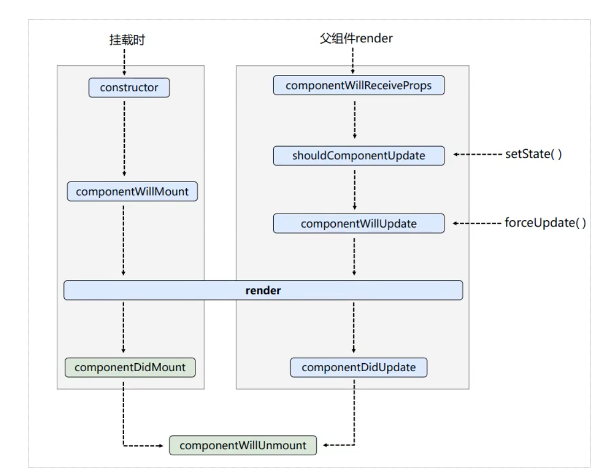
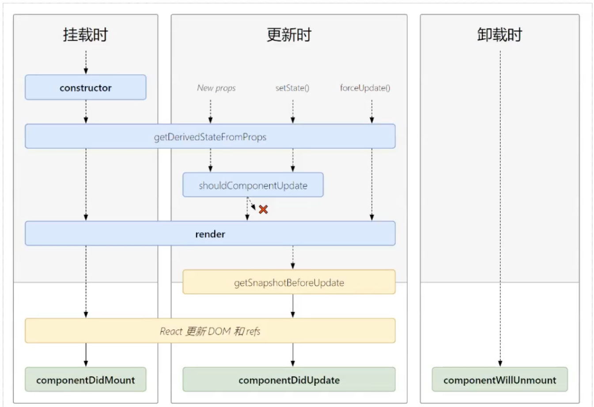

## React生命周期

## 16

#### 挂载卸载过程

##### constructor()

完成了 React 数据的初始化，接收两个参数：props 和 context

##### componentWillMount()

componentWillMount()一般用的比较少，它更多的是在服务端渲染时使用。它代表的过程是组件已经经历了constructor()初始化数据后，但是还未渲染DOM时。

##### componentDIdMount()

组件第一次渲染完成，此时dom节点已经生成，可以在这里调用ajax请求，返回数据setState后组件会重新渲染

##### componentWillUnmount()

在此处完成组件的卸载和数据的销毁。

1. clear你在组建中所有的setTimeout,setInterval
2. 移除所有组建中的监听 removeEventListener

#### 更新过程

##### componentWillReceiveProps(nextProps)

在接受父组件改变后的props需要重新渲染组件时用到的比较多

接受一个参数nextProps

通过对比nextProps和this.props，将nextProps的state为当前组件的state，从而重新渲染组件

##### shouldComponentUpdate(nextProps, nextState)

主要用于性能优化(部分更新)

唯一用于控制组件重新渲染的生命周期，由于在react中，setState以后，state发生变化，组件会进入重新渲染的流程，在这里return false可以阻止组件的更新

因为react父组件的重新渲染会导致其所有子组件的重新渲染，这个时候其实我们是不需要所有子组件都跟着重新渲染的，因此需要在子组件的该生命周期中做判断

##### componentWillUpdate(nextProps, nextState)

shouldComponentUpdate返回true以后，组件进入重新渲染的流程，进入componentWillUpdate,这里同样可以拿到nextProps和nextState。

##### componentDIdUpdate(prevProps,prevState)

组件更新完毕后，react只会在第一次初始化成功会进入componentDIdMount,之后每次重新渲染后都会进入这个生命周期，这里可以拿到prevProps和prevState，即更新前的props和state。

##### render()

render函数会插入jsx生成的dom结构，react会生成一份虚拟dom树，在每一次组件更新时，在此react会通过其diff算法比较更新前后的新旧DOM树，比较以后，找到最小的有差异的DOM节点，并重新渲染

#### 总结

1. 初始化阶段：由 ReactDOM.render() 触发第一次渲染

   1. constructor

   2. componentWillMount

   3. render

   4. componentDidMount

      > 常用，做初始化的事，例如：开启定时器、发送网络请求、订阅消息

2. 更新阶段：由组件内部的 this.setState() 或 父组件 render 触发

   1. shouldComponentUpdate
   2. componentWillUpdate
   3. render
   4. componentDidUpdate

3. 卸载阶段：由 ReactDOM.unmountComponentAtNode() 触发

   1. componentWillUnmount

      > 常用，做收尾的事。例如：关闭定时器，取消订阅消息

## 17

#### 总结

1. 初始化阶段：由 ReactDOM.render() 触发第一次渲染

   1. constructor

   2. getDerivedStateFormProps

   3. render

   4. componentDidMount

      > 常用，做初始化的事，例如：开启定时器、发送网络请求、订阅消息

2. 更新阶段：由组件内部的 this.setState() 或 父组件 render 触发

   1. getDerivedStateFormProps
   2. shouldComponentUpdate
   3. render
   4. getSnapshotBeforeUpdate
   5. componentDidUpdate

3. 卸载阶段：由 ReactDOM.unmountComponentAtNode() 触发

   1. componentWillUnmount

      > 常用，做收尾的事。例如：关闭定时器，取消订阅消息

 

## 16和17的区别

1. 废弃了 3个 will 钩子
   1. componentWillMount
   2. componentWillReceiveProps
   3. componentWillUpdate
2. 新提出 2个
   1. getDerivedStateFromProps
   2. getSnapshotBeforeUpdate
