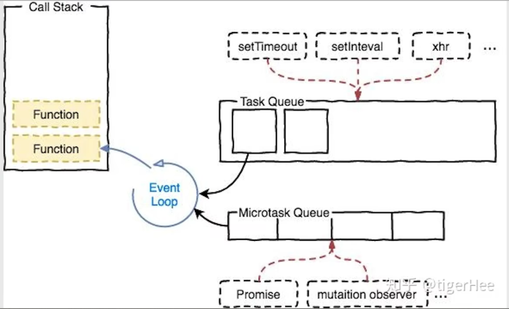
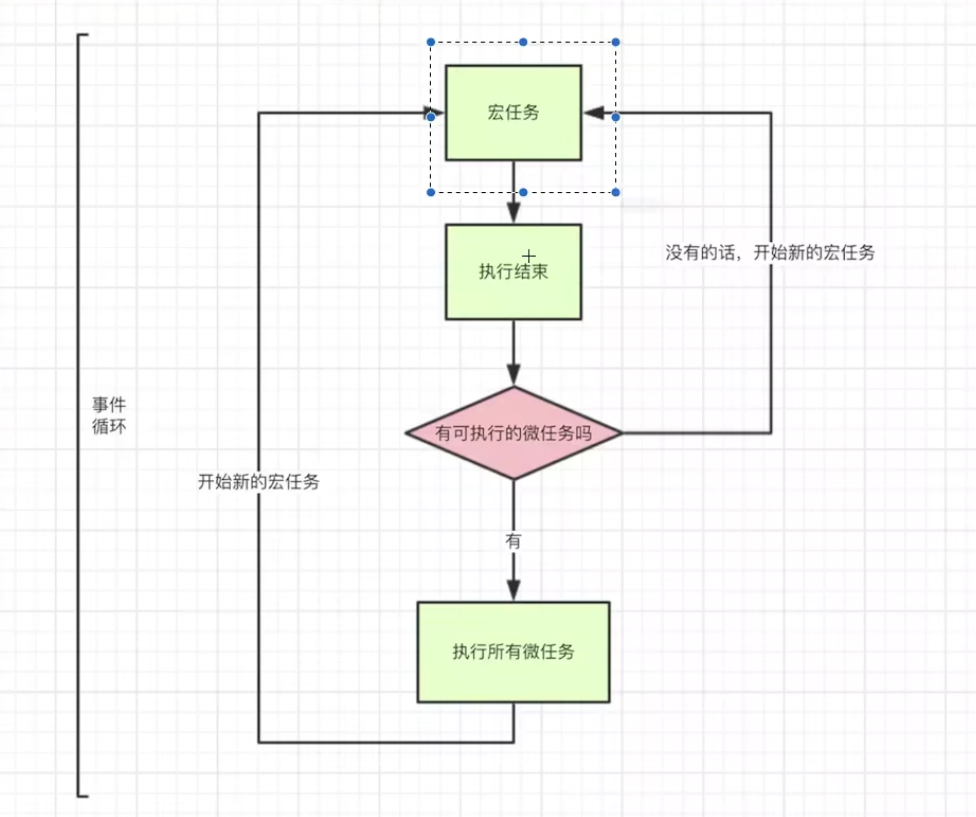

# eventLoop(事件循环)

浏览器内核是多线程，JavaScript是单线程；

> 单线程详解：  
> 因为 js 是面向客户端的一门语言，主要是用户交互，操作dom，渲染数据。试想一下。
> 如果是多线程，我们在一个线程删除了一个dom节点，另外一个线程添加了一个dom节点，以那个线程为主呢，
> 就会出现混乱的情况。当然你可以说我们在操作一个dom之后加上锁，只允许一个线程操作，这样其实增加了程序的复杂度，
> 并不是一个好办法。

 单线程产生的问题：必须等待前一个程序执行完毕才执行下一个，所以将程序分为了两类：同步任务和异步任务。
 **异步任务又可以分为宏任务和微任务**。

## 任务队列
因为 javascript 单线程的原因，单线程，就意味着一个任务一个任务的执行，
执行完当前任务，执行下一个任务，这样也会遇到一个问题，就比如说，要向服务端通信，加载大量数据，如果是同步执行，
js 主线程就得等着这个通信完成，然后才能渲染数据，为了高效率的利用cpu, 就有了同步任务和异步任务之分。

> 同步任务： 指的是在主线程上排队执行的任务，只有前一个任务执行完毕，才能执行后一个任务。
> 异步任务： 指的是不进入主线程，某个异步任务可以执行了，该任务才会进入主线程执行。

## 事件循环

包含 宏任务 和 微任务

### 宏任务

- 分类：setTimeOut、setInterval、setImmediate、requestAnimationFrame、I/O、script脚本等
  1. 宏任务所处的队列就是宏任务队列
  2. 第一个宏任务队列只有一个任务；执行主线程的js代码
  3. 宏任务队列可以有多个
  4. 当宏任务队列中的任务全部执行完以后，会查看是否有微任务队列，如果有先执行微任务队列中的所有任务，

### 微任务

- 分类：new Promise.then()、process.nextTick、MutationObserver
  1. 微任务所处的队列就是微任务队列
  2. 只有一个微任务队列
  3. 在上一个宏任务队列执行完毕后，如果有微任务队列，就会执行微任务队列里的所有任务

## 顺序

先微后宏

> 同步 -> 事件循环【宏任务和微任务】 -> 微任务 -> 宏任务 -> 微任务 。。。
> 只有清空微任务后可以执行宏任务

!!! promise 是立即执行函数
